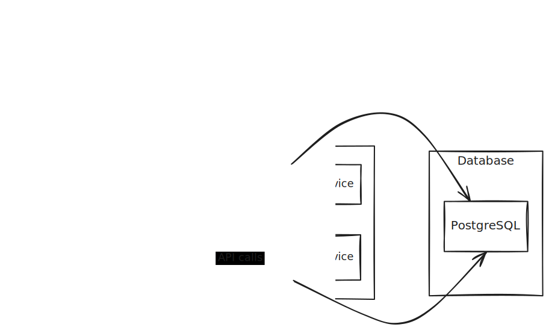

# System Architecture

  

This diagram illustrates the high-level architecture of the Fullstack Developer Portfolio project. It shows the frontend, backend services, database, and their interactions.

**Key Components:**

* **Portfolio Frontend:** The user interface built with React and TypeScript, responsible for displaying projects, handling user interactions, and communicating with the backend services.

* **Auth Service:** A Java-based service built with Spring Boot, responsible for user authentication, authorization, and managing user data.

* **Data Service:** A Python-based service built with FastAPI, responsible for handling project data, processing requests, and potentially integrating with machine learning models.

* **PostgreSQL:** The relational database used to store user information, project details, and other application data.
